# Shutter Share

Completed as Term 2 Ruby on Rails assessment at [Coder Academy's](https://coderacademy.edu.au/) GenTech 2019 Bootcamp.

## Table of Contents
* [Problem Statement](#problem-statement)
* [Important Links](#important-links)
* [Description](#description)
    - [Purpose](#purpose)
    - [Features](#features)
    - [Functionality](#functionality)
    - [Sitemap](#sitemap)
    - [Screenshots](#screenshots)
    - [Target Audience](#target-audience)
    - [Tech stack](#tech-stack)
* [User Stories](#user-stories)
* [Wireframes](#wireframes)
* [ERD Diagram](#erd-diagram)
* [Components](#components)
* [Third Party Services](#third-party-services)
* [Models and Associations](#models-and-associations)
* [Database Relations](#database-relations)
* [Database Schema](#database-schema)
* [Project Management](#project-management)

<!-- R7	Identification of the problem you are trying to solve by building this particular marketplace app. -->
<!-- R8	Why is it a problem that needs solving? -->

 ([Back to Table of Contents](#table-of-contents))
## Problem Statement

- What

    To get started with photography a photographer not only requires to have a decent camera but plethora of accessories and lenses. For example, a typical professional level photo shoot requires a good camera body, at least two to three fast aperature lenses, a couple of lights (strobes or speed lights), light modifiers, light stands etc... Therefore it would be very costly to own all the gear when someone starts with the photography. In another use case there are situations where a specific kind of lens is required ony for specific kind of photography genre and it's not very practical to buy a new lens for one off use.
    
    In the kind of situations described above it would be very convenient to be able to get rent someone else's equipment, use and return it when done.
    
    The biggest problem is that due to the niche involved there are very few places who rent out equipment and due to the lack of competition the demand drives the prices which does not work well for small time individual photographers.
    
    Therefore it would add a lot value by creating an online platform that would bring photography community together that can help each other by sharing the gear and make some extra money.

- Why
    
    The platform needs to be online because in online space there are even less providers that encourages sharing the photography gear among the photographers. The options that exists are limited to specific camera brand, or are not two sided, or are mainly focused on big production houses or otherwise does not operate in Australia.
    
    Therefore it is important have an online platform which is brand independent and caters to individual photographers within Australia. Moreover having an online platform gives scalability to bring photography community from different locations to come together and cater to each other's photographic equipment requirements.

 ([Back to Table of Contents](#table-of-contents))

<!-- R9	A link (URL) to your deployed app (i.e. website)
R10	A link to your GitHub repository (repo). -->

## Important Links

- Project: https://shutter-share.herokuapp.com/

- GitHub Repo: https://github.com/hirengondhiya/shutter-share

<!-- R11	Description of your marketplace app (website), including:
- Purpose
- Functionality / features
- Sitemap
- Screenshots
- Target audience
- Tech stack (e.g. html, css, deployment platform, etc) -->
 ([Back to Table of Contents](#table-of-contents))

## Description
    
- ### Purpose

    The purpose of this app is to create a two sided online marketplace for photographer to rent out their camera gear. 

- ### Features

    The app has following features
    
    1. **User management**
        
        Ability to
        - Sign up
        - Sign in
        - Sign out
    2. **Profile management**
        
        Ability to
        - View profile
        - Edit profile
        - Upload image to signed in user's profile
        - Remove image from signed in user's profile
        - View signed in user's public profile
        - View other user's public profile
    3. **Listing management**
        
        Ability to
        - Add listing
        - Edit listing
        - Remove listing
        - View listing
        - View all other user's listings
        - View all listings created by signed in user
        - Upload images to the listing
        - Remove images from the listing
    3. **Lease management**

        Ability to
        - Create a lease request on someone else's listing
        - Edit a lease request created by the signed in user
        - Cancel a lease requet created by the signed in user
        - Accept lease requests received on a items listed by signed in user
        - Reject lease requests received on a items listed by signed in user
        - View all lease requests created by a signed in user
        - View all lease requests received on listings created by a signed in user

- ### Fuctionality
- ### Sitemap

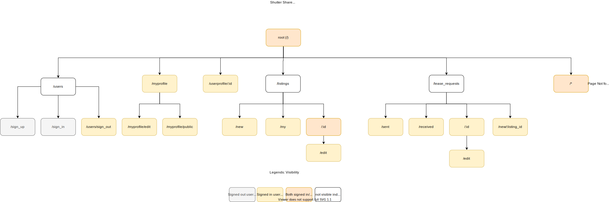

- ### Screenshots

1. **Home Page Not Signed in**

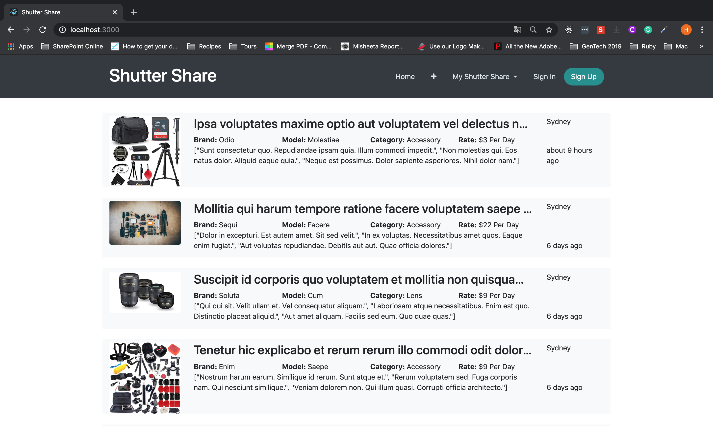

2. **Home Signed in**

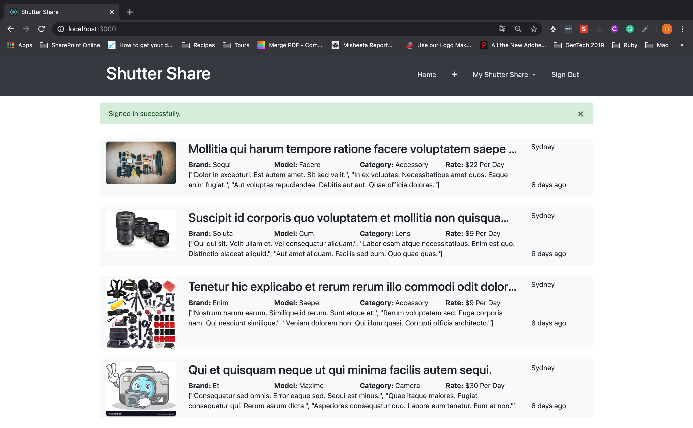

3. **Home Page Signed in - Expanded MyShutterShare Menu**

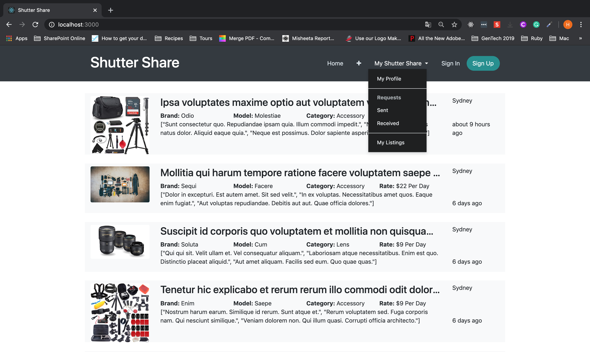

4. **View Listing as Visitor**

- When not signed in

    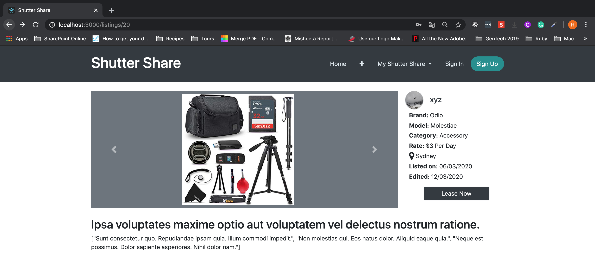
- When signed in

    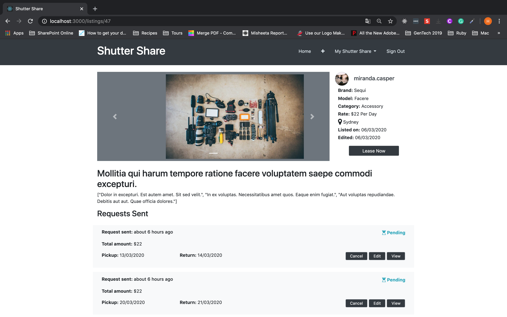

5. **View Listing as Owner**

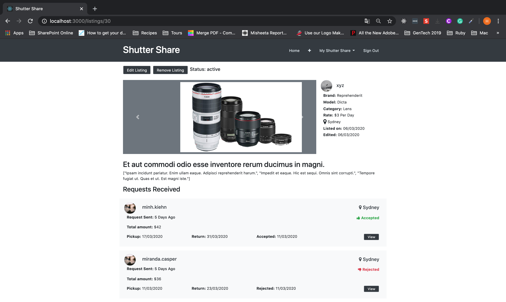

6. **View My Listings**

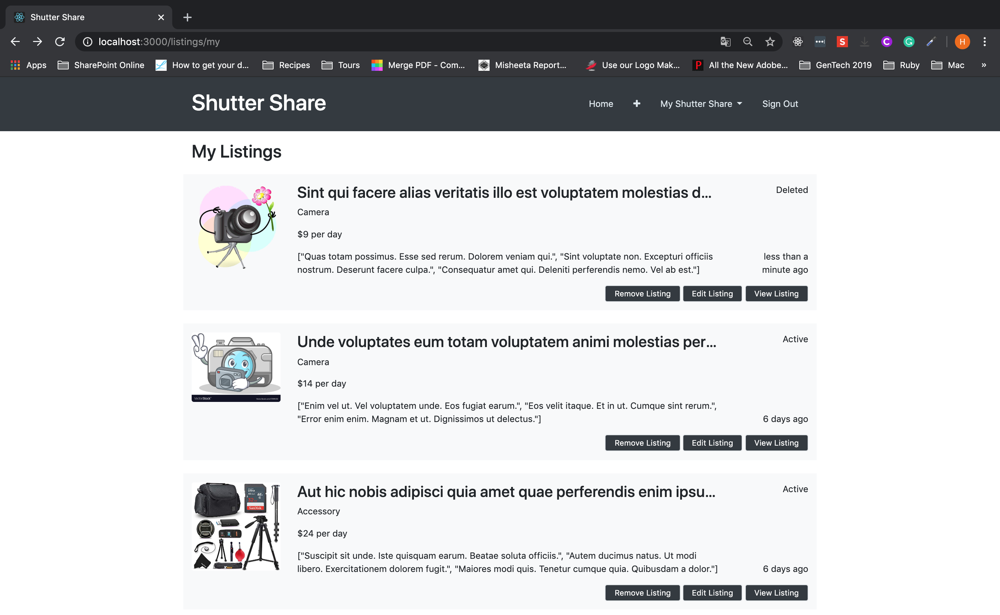

7. **Add Listing**

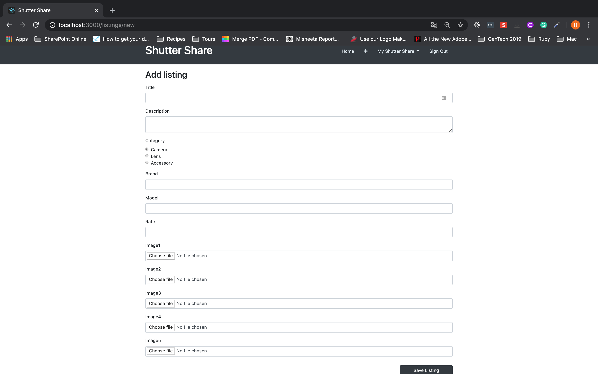

8. **Edit Listing**

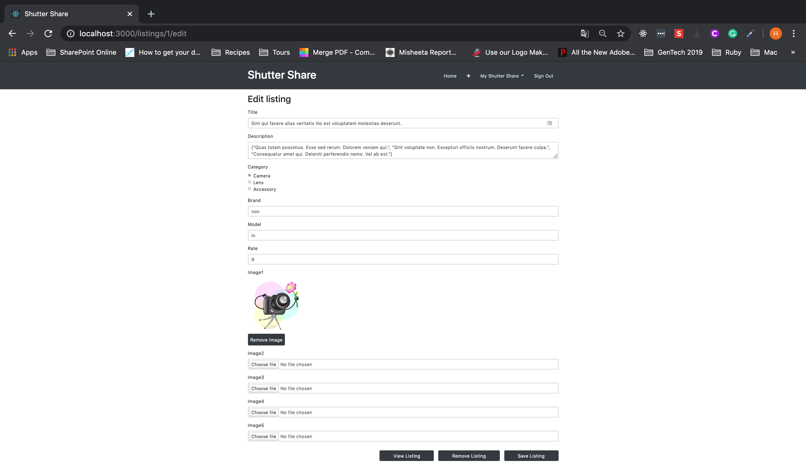

9. **Make Lease Request**

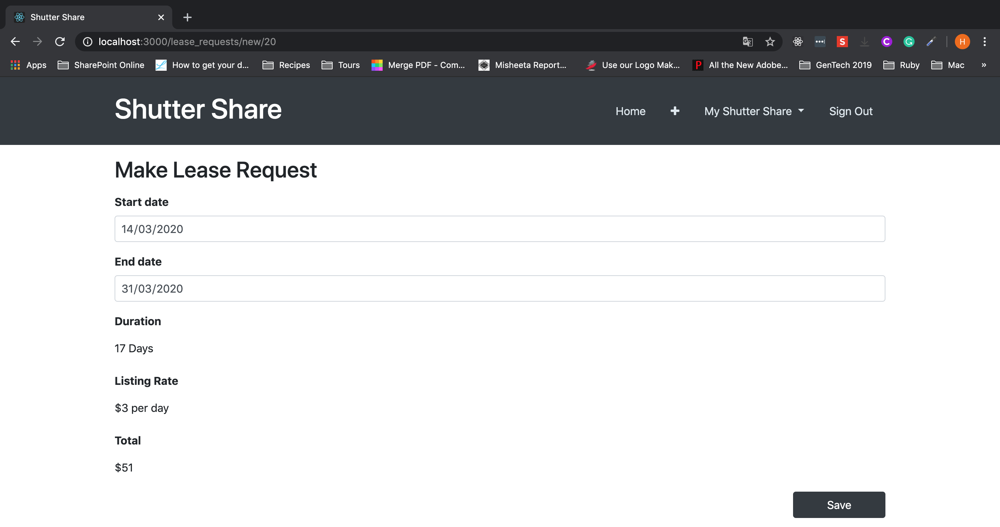

10. **Edit Lease Request**

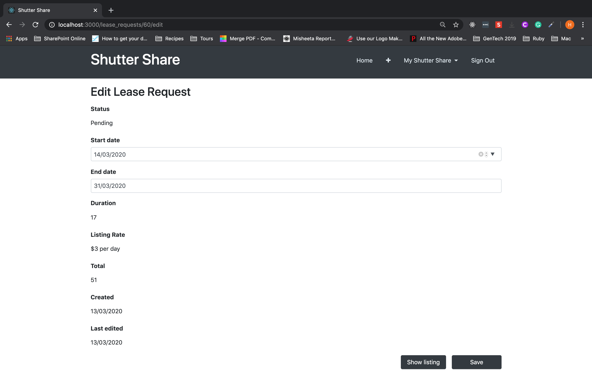

11. **View Lease Request - Lease Requester**

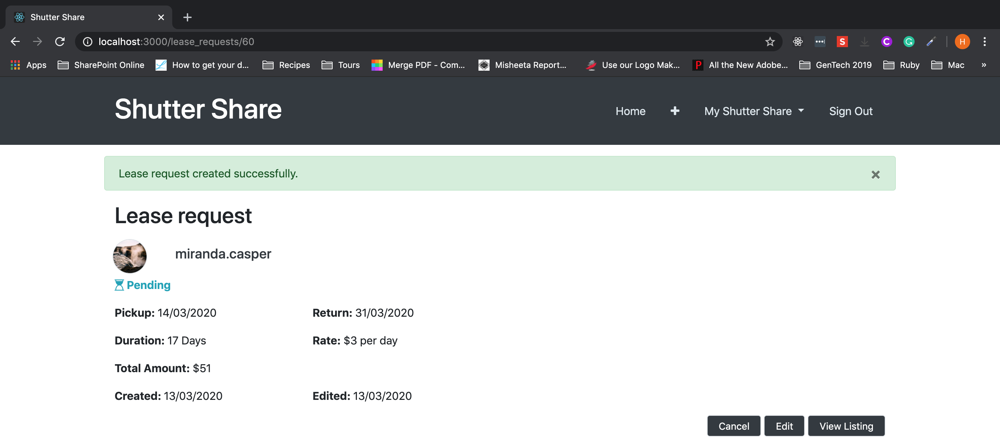

12. **View Lease Request - Listing Owner**

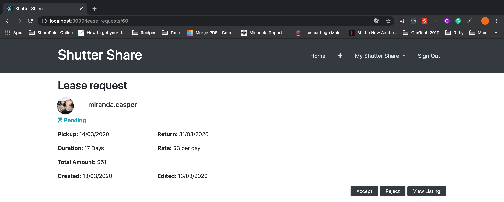

13. **View All Lease Requests - Sent**

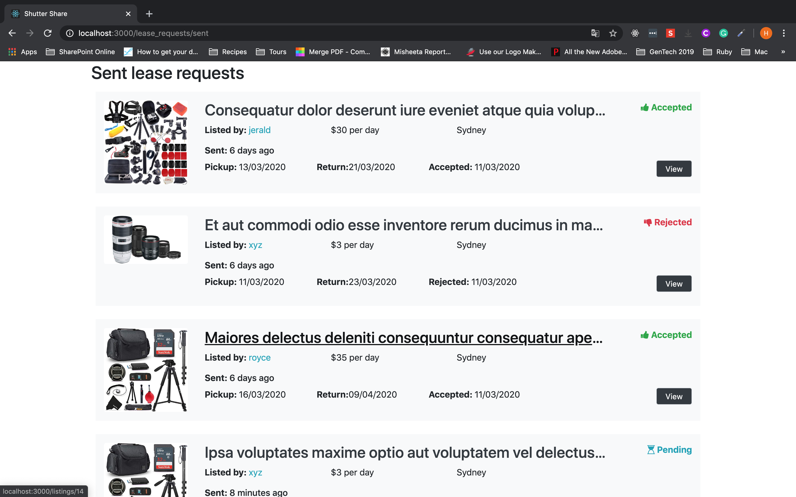

14. **View All Lease Reqeuests - Received**

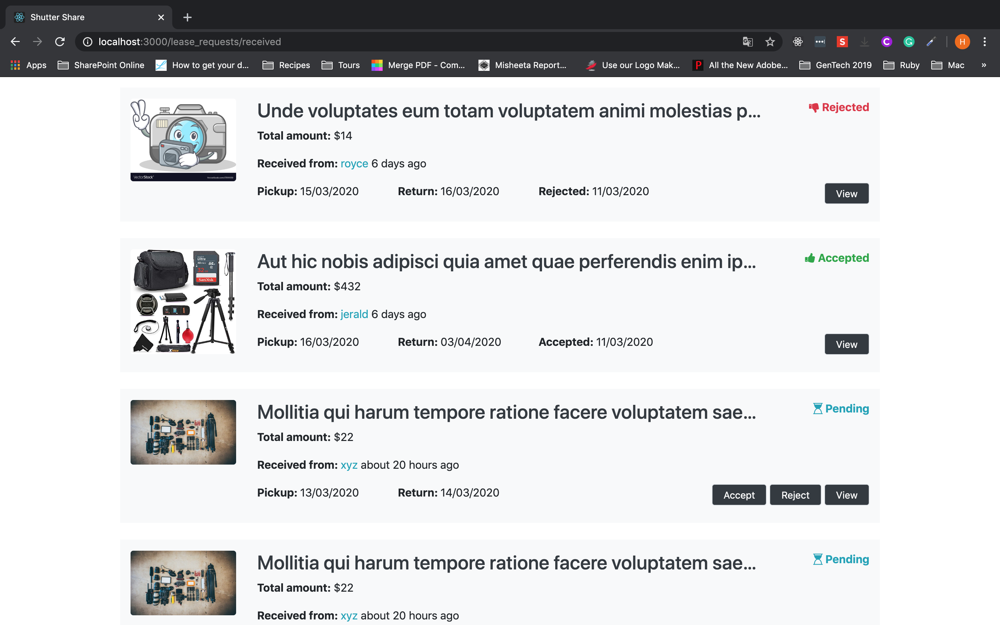

15. **View My Profile**

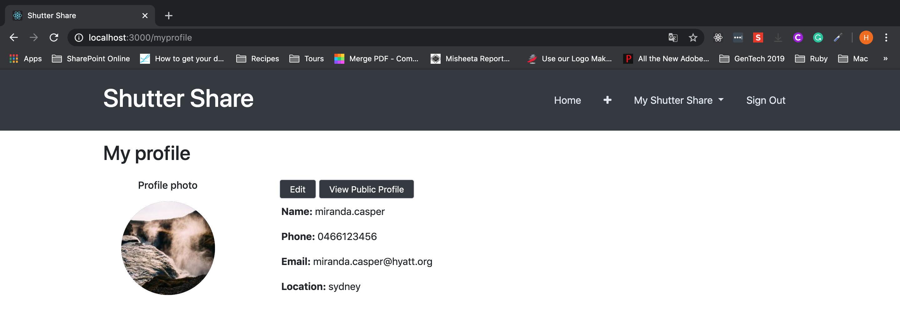

16. **Edit My Profile**

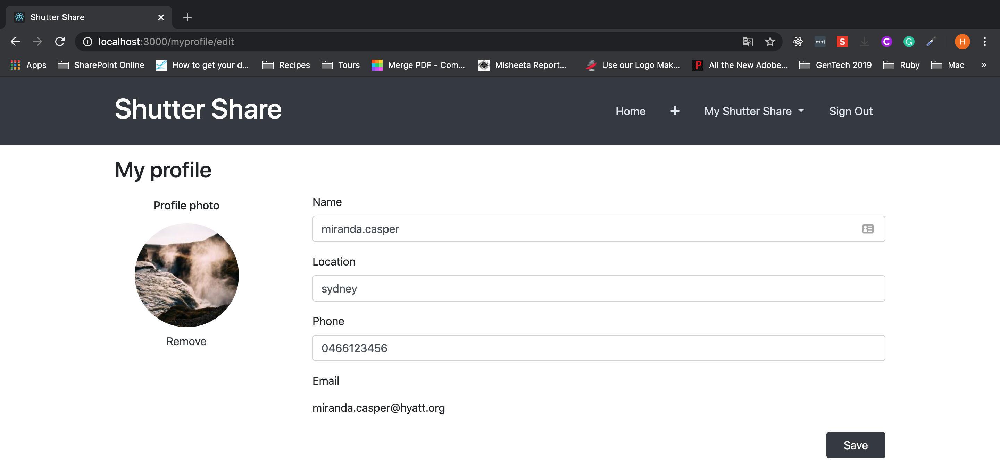

17. **View Public Profile(My/Any other user)**

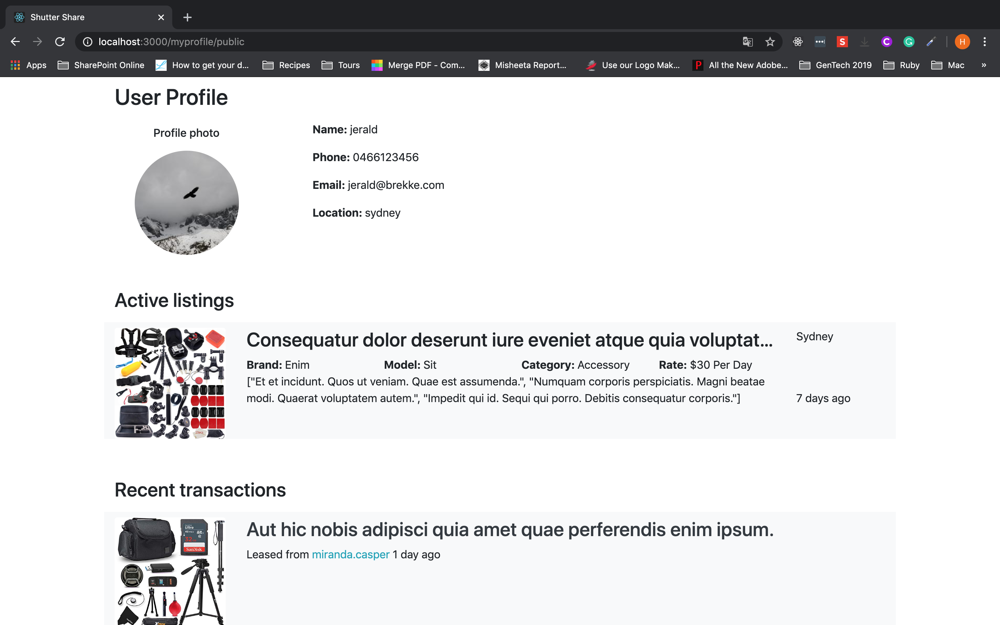

- ### Target Audience
    Target audience of this app is any photographer who would like to rent someone else's photo gear and/or rent out their own photography equipment. This way the person renting someone's equipment can avoids costs associated with owning the gear that is not frequently used and the users renting out can have more value out of their investment. 
- ### Tech stack
    * Ruby on Rails
    * HTML
    * CSS
    * SASS
    * Bootstrap 4
    * Bootstrap Studio
    * Heroku
    * Amazon S3
    * Devise (for authentication)

([Back to Table of Contents](#table-of-contents))
<!-- R12	User stories for your app -->

## User Stories

* ### User Management
    
    #### Features
    
    - **Sign up**:
    
        As a site visitor, I should be able to sign up with my email id and create a password in order to register my self in site database.
        
    - **Sign in**:
    
        As an existing user, when I am not signed in, I should be able to sign in using the credentials that I signed up with to use logged in user features.
        
    - **Sign out**:
    
        As a Signed in User, I should be able to Sign out of my signed in account to end my sign in session. 
        
     
* ### Profile Management

    #### Features
    - **Edit Profile**:
        
        As a signed in user, I should be able to update my public information in order to make my details visible on my profile.
    - **Upload Profile Pic**:
        
        As a signed in user, I should be able to upload my profile picture to make it is visible to other users.
    - **Delete Profile Pic**:
        
        As a signed in user, I should be able to delete my profile picture to make it unavailable to other site users.
    - **View My Public Profile**:
    
        As a signed in user, I should be able to view my public profile page in order to see how it appears to other users.
    - **View Other Site User's Public Profile**:
    
        As a signed in user, I should be able to view other site user's public profile page in order to see their listings and Recent transactions.
* ### Listing Management
    #### Features
    - **Create listing**:
        
        As a signed in user, I should be able to create a new listing in order to advertise my gear for leasing.
    - **Update listing:**
        
        As a signed in listing owner, I should be able to update previously created listing in order to keep my listing updated with current information about the gear.
    - **Remove listing**:
        
        As a signed in listing owner, I should be able to remove previously created listing to make it unavailable for leasing.
    - **Upload photos for listing**:
        
        As a signed in user, I should be able to upload photos to the listing created by me in order to show item condition.
    - **View individual listing**:
        
        As a site visitor, I should be able to view an individual listing in order to find out details of the item and to be able to lease it.
    - **View all listings**:
        
        As a site visitor, I should be able to view all the available listings on the site in order to find all available items.
* ### Lease Management
    #### Features
    
    - **Request for lease**:
    
        As a signed in user, I should be able to send lease request on someone else's listing in order express my intent to lease the item.
        
    - **Cancel lease request**:
        
        As a signed in lease request owner, I should be able to cancel my pending lease requests in to withdraw my request to lease the item.
        
    - **Accept or Reject**:
    
        As a listing owner, I should be able to accept or reject the lease requests on my own listings in order to approve or deny lease requests from various users.
        
    - **View all lease requests received**:
        
        As a listing owner, I should be able to view all lease requests received on my listings in order to act on various lease requests.
    - **View all lease requests made**:
    
        As a signed in user, I should be able to view all lease requests that I made on someone else' listing in order to view statuses of my requests as well as to update my requests.
            
 ([Back to Table of Contents](#table-of-contents))

## Wireframes

1. **Home Page Not Signed in**

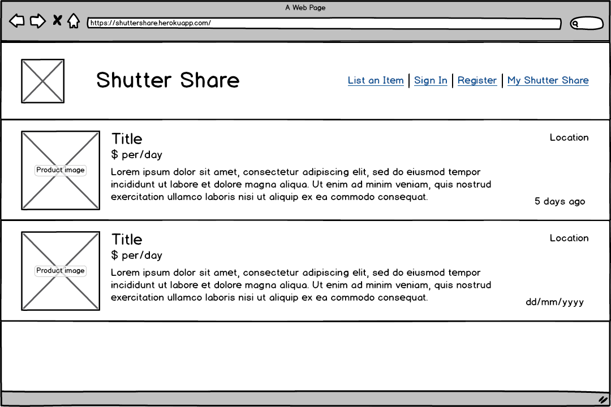

2. **Home Signed in**

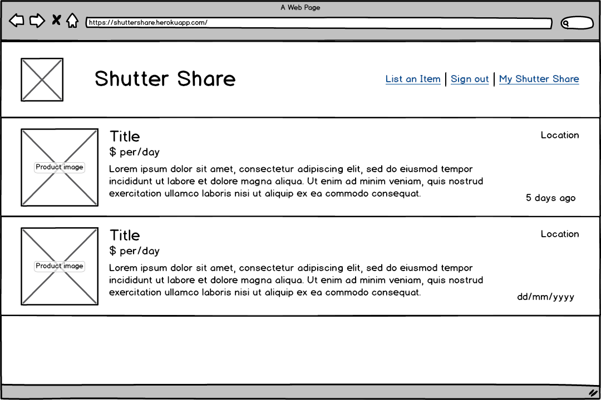

3. **Home Page Signed in - Expanded MyShutterShare Menu**

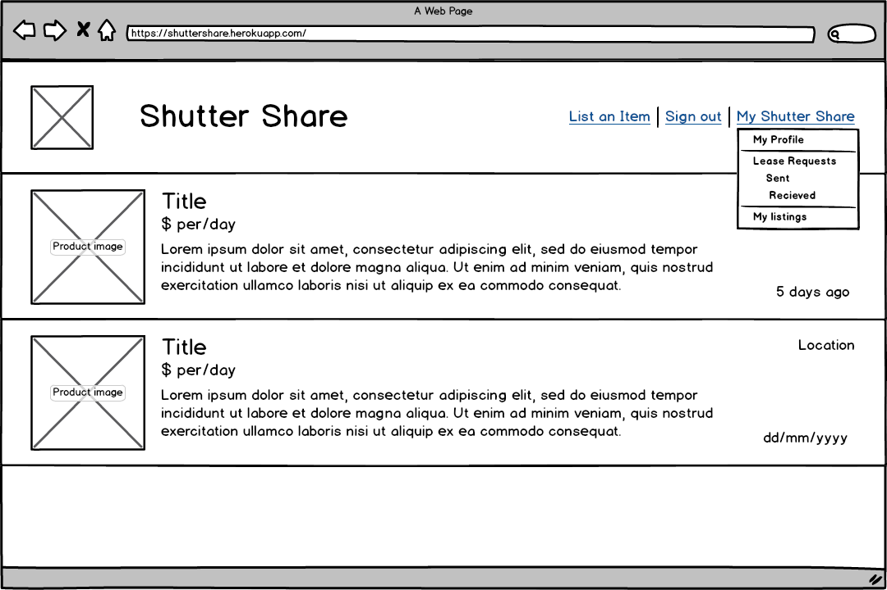

4. **View Listing as Visitor**

.png)

5. **View Listing as Owner**

.png)

6. **View My Listings**

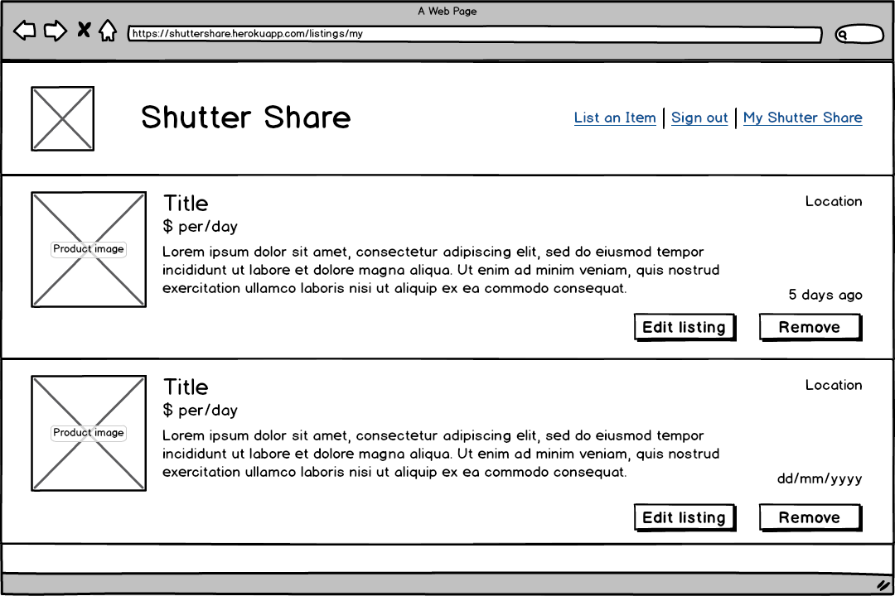

7. **Add Listing**

8. **Edit Listing**

9. **Make Lease Request**

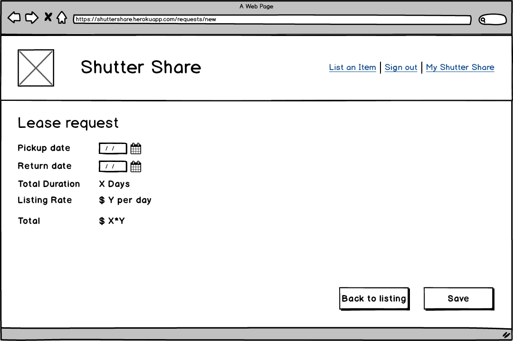

10. **Edit Lease Request**

11. **View Lease Request - Lease Requester**

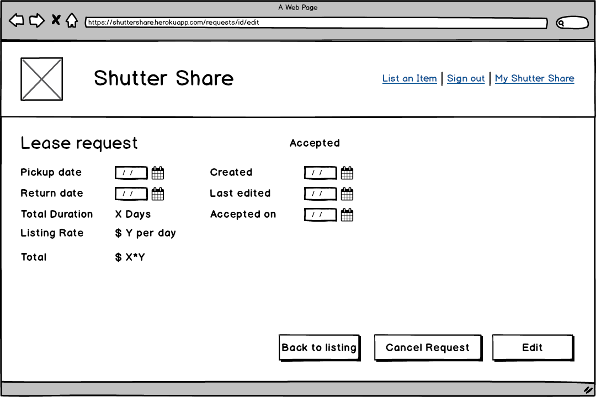

12. **View Lease Request - Listing Owner**

13. **View All Lease Requests - Sent**

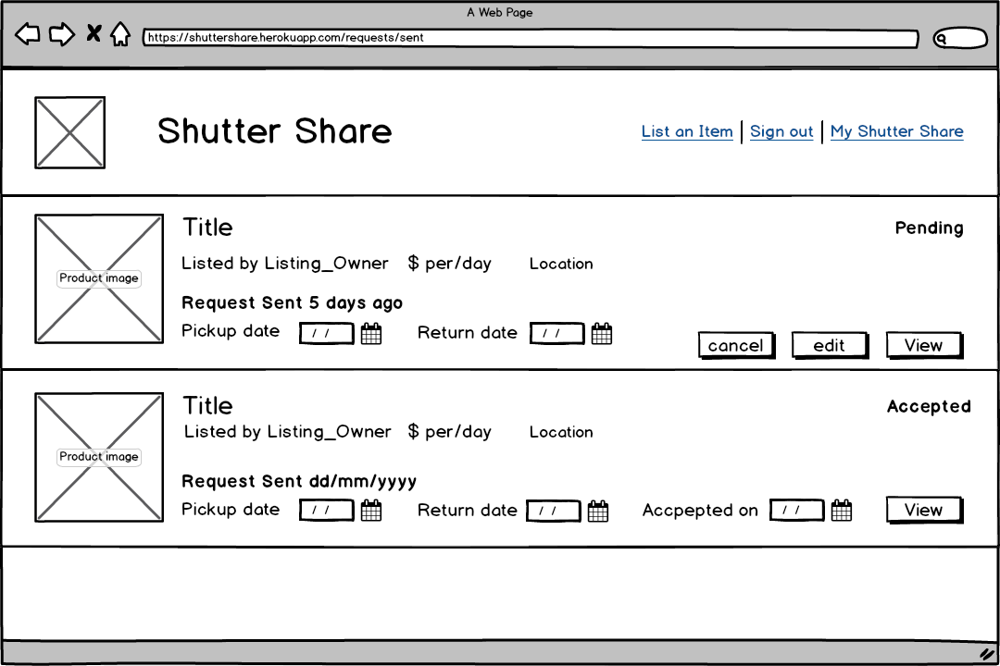

14. **View All Lease Reqeuests - Received**

15. **View My Profile**

.png)

16. **Edit My Profile**

.png)

17. **View Public Profile(My/Any other user)**

 ([Back to Table of Contents](#table-of-contents))

<!-- R14	An ERD for your app -->

## ERD Diagram

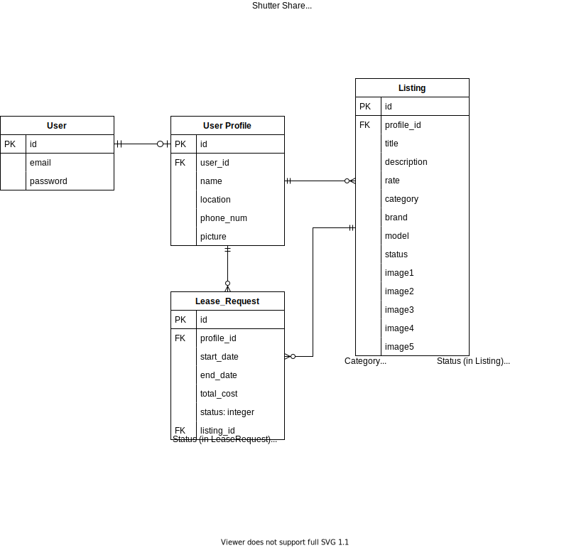

([Back to Table of Contents](#table-of-contents))

<!-- R15	Explain the different high-level components (abstractions) in your app -->

## Components

([Back to Table of Contents](#table-of-contents))

<!-- R16	Detail any third party services that your app will use -->

## Third Party Services

The app uses following third party services,

- Amazon S3: 
    
    A cloud based blob storage service, provided by Amazon AWS, to hold all the images uploaded by the users of Shtter Share the app.
- Amazon IAM: 
    
    AWS Identity and Access Management (IAM) service to manage access to AWS services and resources securely. 
    
    Used IAM, to create AWS user, and used permissions to allow and deny their access to Amazon S3.
- Heroku: 

    A cloud based hosting provider to be able to deploy the app on cloud and access it using the internet. 

    Used Heroku to deploy Shutter Share app on internet.

([Back to Table of Contents](#table-of-contents))

<!-- R17	Describe your projects models in terms of the relationships (active record associations) they have with each 
other -->

## Models and Associations

([Back to Table of Contents](#table-of-contents))
<!-- R18	Discuss the database relations to be implemented in your application -->

## Database Relations

([Back to Table of Contents](#table-of-contents))
<!-- R19	Provide your database schema design -->

## Database Schema

Following image shows schema diagram of the various tables and their relationships.

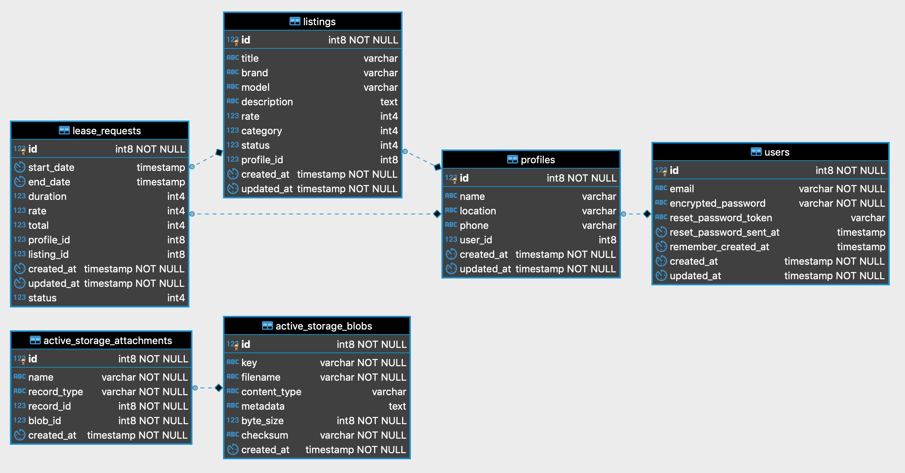

([Back to Table of Contents](#table-of-contents))
<!-- R20	Describe the way tasks are allocated and tracked in your project -->

## Project Management

([Back to Table of Contents](#table-of-contents))